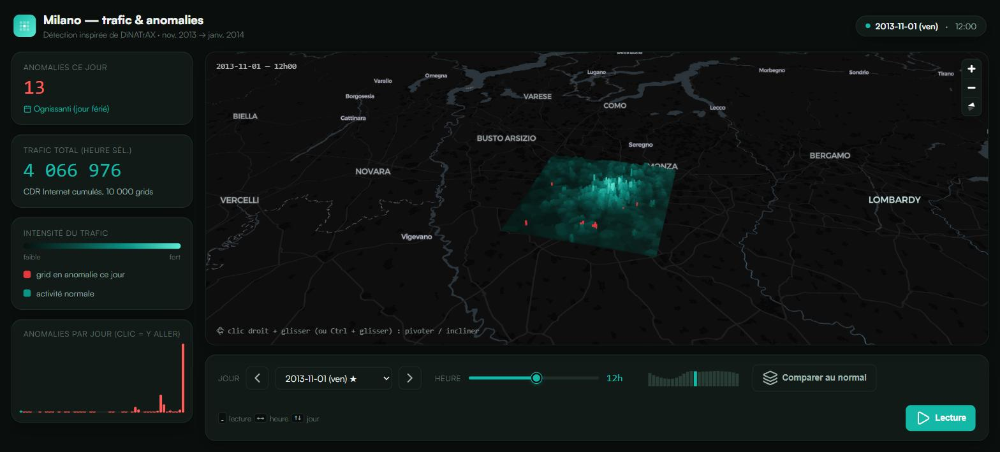

# 4G/5G Anomaly Detection — Milan

Détection d'anomalies dans le trafic Internet mobile de la ville de Milan, à
partir du dataset **Telecom Italia Big Data Challenge**. L'approche encode le
profil horaire de trafic de chaque zone en une signature façon "ADN", compare
chaque journée à un profil de référence via la distance de Damerau-Levenshtein,
puis calcule un score z pour isoler les jours anormaux — inspirée du framework
académique **DiNATrAX** (Maudoux & Boumerdassi, IEEE ICC 2024). Les anomalies
détectées sont ensuite recoupées avec un calendrier d'événements (jours fériés,
matchs à San Siro) et explorables sur un tableau de bord 3D.



## Fonctionnalités

- **Encodage en signatures** : le trafic Internet horaire de chaque grille est
  encodé en 6 niveaux (A à F), chacun correspondant à un multiple fixe et
  publié de la médiane horaire de la grille (seuils calibrés sur les
  percentiles réels du dataset, de < 0,43× à > 2,1×), pour former une
  séquence de 24 lettres par jour, comparable d'une grille à l'autre et
  sensible aux variations d'amplitude du trafic.
- **Détection par distance d'édition** : chaque séquence journalière est
  comparée, via la distance de Damerau-Levenshtein, à un profil de référence
  construit par consensus sur les autres jours de la même grille et du même
  jour de la semaine.
- **Score z et seuil d'anomalie** : les distances sont converties en score z
  par grille ; un jour est marqué anormal au-delà d'un seuil (z > 3).
- **Rapprochement calendaire** : les jours anormaux sont recoupés avec un
  calendrier construit à la main (jours fériés italiens, matchs à domicile de
  l'AC Milan et de l'Inter à San Siro) pour distinguer une anomalie expliquée
  d'un signal réellement inattendu.
- **Dashboard 3D interactif** (`viz/milan_3d.html`) : carte 3D de Milan
  (deck.gl + MapLibre GL JS) avec navigation jour/heure, lecture automatique,
  mode de comparaison au profil normal (silhouette superposée), et anomalies
  mises en évidence par grille.

## Pipeline

Le traitement, entièrement dans `eda.ipynb`, suit ces étapes :

```
sms-call-internet-mi-*.txt (62 fichiers, ~4M lignes chacun)
        │
        ▼
  agrégation par (grille, jour, heure) — trafic Internet total
        │
        ▼
  encodage en signature de 24 lettres (multiples de la médiane horaire, A→F)
        │
        ▼
  profil de référence par (grille, jour de semaine) — consensus lettre à lettre
        │
        ▼
  distance de Damerau-Levenshtein (signature du jour ↔ profil de référence)
        │
        ▼
  score z par grille  →  jour anormal si z > 3
        │
        ▼
  recoupement avec le calendrier d'événements (fériés, matchs San Siro)
        │
        ▼
  export (GeoJSON de la grille, trafic et flags binaires) → dashboard 3D
```

## Stack technique

| Usage | Technologie |
|---|---|
| Traitement des données | Python, pandas, numpy |
| Distance d'édition | rapidfuzz (Damerau-Levenshtein) |
| Géométrie / cartes statiques | geopandas, folium, matplotlib |
| Analyse exploratoire | Jupyter Notebook |
| Dashboard 3D | deck.gl, MapLibre GL JS, JavaScript vanilla |
| Icônes / police | Lucide, Satoshi (Fontshare) |
| Données | Telecom Italia Big Data Challenge (Harvard Dataverse, licence ODbL) |

## Structure du projet

```
4G_5G_anomaly_detection/
├── Data/
│   └── Description_data.md     format et sémantique des fichiers sources
├── eda.ipynb                   pipeline complet : encodage, distance, z-score,
│                                calendrier, export
├── viz/
│   ├── milan_3d.html            dashboard 3D
│   ├── milano-grid-wgs84.geojson géométrie des grilles (reprojetée WGS84)
│   ├── traffic.bin               trafic horaire par grille (binaire compact)
│   ├── anomaly.bin               flags d'anomalie par (jour, grille) — méthode bloc journalier
│   ├── anomaly_hourly.bin        état par (jour, heure, grille) — méthode fenêtre glissante,
│   │                              utilisé par le dashboard
│   └── meta.json                 dates, identifiants de grille, dimensions
├── presentation.html            présentation scrollytelling du projet
├── docs/
│   └── screenshot.jpg
├── requirements.txt
└── LICENSE
```

## Démarrage

### Prérequis

- Python 3.11+

```bash
python -m venv venv
venv\Scripts\activate       # sous Windows ; `source venv/bin/activate` sous macOS/Linux
pip install -r requirements.txt
```

### Notebook d'analyse

Le dataset source (les 62 fichiers `sms-call-internet-mi-*.txt`, ~250 Mo
chacun) n'est pas inclus dans ce dépôt — le récupérer depuis
[Harvard Dataverse](https://doi.org/10.7910/DVN/EGZHFV) et le placer dans
`Data/dataverse_files/`. Ouvrir ensuite `eda.ipynb` avec Jupyter :

```bash
jupyter notebook eda.ipynb
```

### Dashboard 3D

Le dashboard charge ses données via `fetch()`, ce qui nécessite un serveur
HTTP local (une ouverture directe du fichier ne fonctionnera pas, à cause des
restrictions CORS sur `file://`) :

```bash
cd viz
python -m http.server 8000
# puis ouvrir http://localhost:8000/milan_3d.html
```

## Données

- Source : [Telecom Italia Big Data Challenge](https://doi.org/10.7910/DVN/EGZHFV) (Harvard Dataverse, licence ODbL)
- Période couverte : 1er novembre 2013 → 1er janvier 2014 (62 fichiers, un par jour)
- Détail complet des champs et du format : [`Data/Description_data.md`](Data/Description_data.md)
